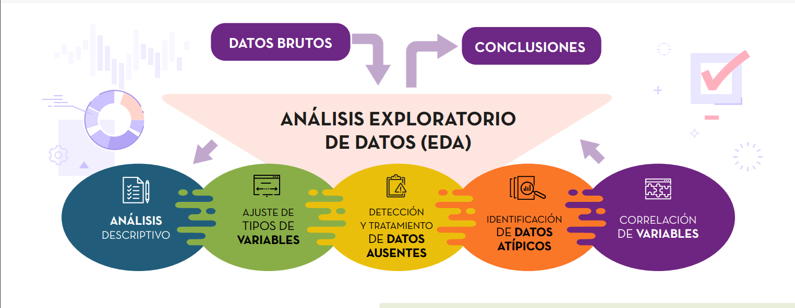

# MACHINE LEARNING OPERATIONS (MOLps)

## Proyecto de Recomendación a la empresa STEAM : Plataforma multinacional de Videojuegos.

## Objetivos del Proyecto: 

 El objetivo principal del proyecto es crear un sistema de recomendación de videojuegos para usuarios en la plataforma Steam y desarrollar un MVP (Minimum Viable Product) que consiste en una API , que pueda ser consumida desde cualquier dispositivo conectado a internet. Este sistema de recomendación debe ser capaz de proporcionar a los usuarios recomendaciones personalizadas de videojuegos basadas en sus preferencias y comportamiento de compra, además de alojar y mantener esta API en la plataforma Render para garantizar su disponibilidad y escalabilidad.  

#### **Pasos que involucran el proyecto desde el inicio del proceso ETL (Extract, Transform, Load) hasta la creación de la API y disponibilidad en la plataforma Render** 

**1.- Importaión de las librerias necesarias para trabajar en vsc con Python.**  

  
**2.- Proceso del ETL:** (Extraer, transformar, cargar)
Se importaron los archivos y se extrajeron datos de tres archivos json comprimidos en formato zip, dos de los cuales tenían columnas anidadas, y se convirtieron en DataFrames,  utilizando la librería Pandas en Python.. Se hace la revision de la data para analizar su estructura con las funciones que nos proporciona esta librería, como:head, shape, info, describe. Isnull, etc. 
Se realizaron tareas de validación y limpieza de datos, como eliminar duplicados, eliminar valores nulos, columnas no necesarias para nuestro modelo, cambio de tipo de datos, entre otros,  según las necesidades del proyecto. 
Se combinaron los datos de los diferentes DataFrames, se realizaron  uniones utilizando las funciones de Pandas pd.merge().Los DataFrames resultantes se almacenaron  en una ubicación específica y se utilizaron para el análisis posterior, según los requisitos del proyecto, como son el Modelo de ML y el EDA. 

### FUENTES DE DATOS: 

**-Dataset** : el cual incluye tres archivos que debemos importar y luego procesar (steam_games.json.gz, user_reviews_json.gz, users_items.json.)
**- Diccionario de datos** : con algunas descripciones de las columnas que están disponibles en el dataset. [Fuente de datos](https://drive.google.com/drive/folders/1-wPR1TltFnhXaQS_FQ7TFw4DKL6658f3?usp=sharing)

**-EDA:** Conjunto de técnicas estadísticas dirigidas a explorar, describir y resumir la información que contienen los datos, maximizando su comprensión. Con este análisis trate de comprender la relación que existe entre las varialbes del dataset, buscando outliers, creando una matriz de correlación para un mejor análisis de los datos. También haremos un análisis estadístico así como la visualización de diferentes gráficos.

 

### REPOSITORIO:
En github, creamos un repositorio donde tendremos todo los archivos de nuestro proyecto, el cual se conectará con Render con el servicio Web que creamos.

### DEPLOY:
Creamos un deploy en render para poder tener un entorno donde nuestra API, pueda ser consumida por cualquier persona.

### DESARRLLO DE LA API:
Utilizando el framework FastAPI, las consultas propuestas son:

####  def PlayTimeGenre(genero):
####  def UserForGenre(genero):
####  def UsersRecommend(year: int):
####  def UsersNotRecommend(year: int):
####  def sentiment_analysis(year: int):  

### Dejo el link a la api: [Acceso a la Api](https://api-henry-mlops.onrender.com/docs)

### SISTEMA DE RECOMENDACIÓN: 
Por último crearemos un modelo de Machine Learning para la recomendación de juegos basándose en juegos similares. Todo esto lo llevaremos con una función a ser consumida por la API. La consulta será:
####  **- def recomendacion_juego(item_name):**

#### He realizado un vídeo con una breve descripción del proyecto [Video](https://www.youtube.com/watch?v=B2wgW4MXN5U)

**Realizado por: Nelly Molina Contreras, Data Science.**